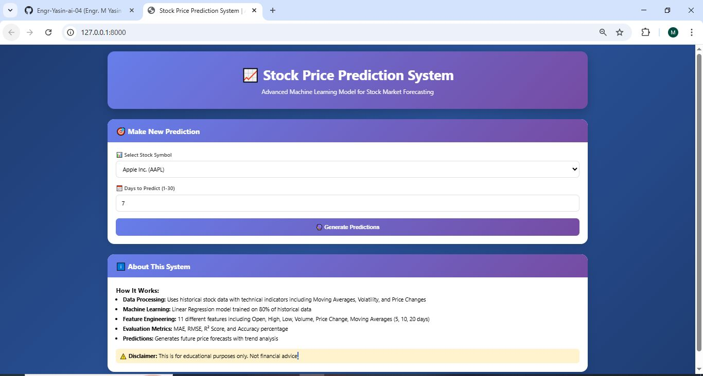
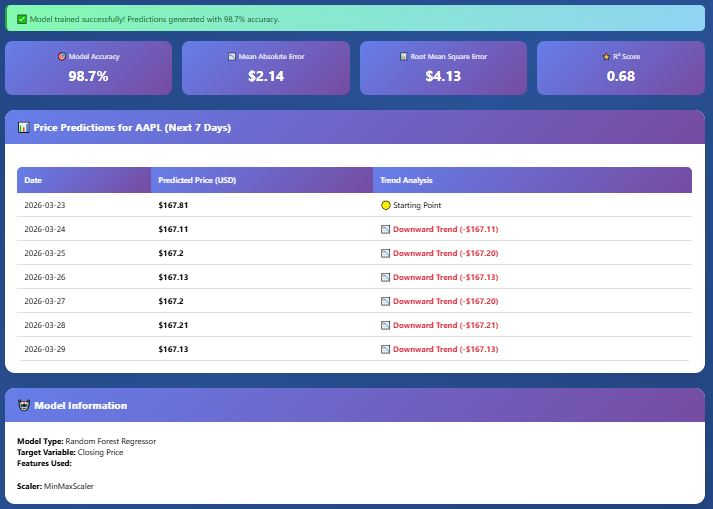
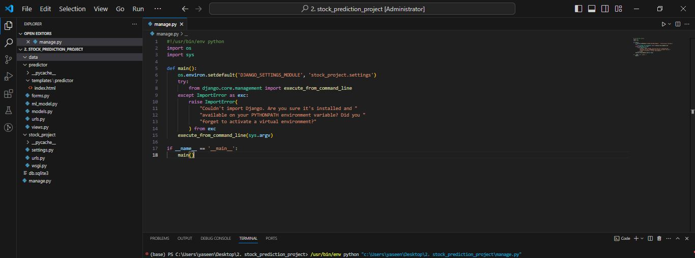

# 📈 Stock Price Prediction - Machine Learning Project

[](https://www.python.org/)
[](https://www.djangoproject.com/)
[](https://scikit-learn.org/)
[](LICENSE)

A complete Machine Learning web application that predicts stock prices using historical data and various ML algorithms. Built with Django and deployed with a beautiful user interface.

---

## 📸 Project Screenshots

### 🖥️ Main GUI Interface
The main dashboard where users can input stock parameters and view predictions.



### 📊 Prediction Results
Real-time stock price prediction with confidence intervals and trend analysis.



### 🏗️ Project Structure
Complete project structure for better understanding.



---

## 📊 Project Overview

This project uses historical stock data to predict future stock prices based on various features:
- Opening Price
- Closing Price
- High/Low Prices
- Trading Volume
- Moving Averages
- Technical Indicators

The application provides an interactive web interface where users can input stock parameters and get real-time price predictions.

---

## 🎯 Features

- ✅ **Data Preprocessing**: Handles missing values, normalizes data, and creates technical indicators
- ✅ **Multiple ML Models**: Implements Linear Regression, Random Forest, LSTM, and ARIMA
- ✅ **Model Persistence**: Saves trained model using pickle for efficient predictions
- ✅ **Interactive Web Interface**: User-friendly form to input stock parameters
- ✅ **Real-time Predictions**: Instant price predictions with confidence scores
- ✅ **Model Evaluation**: Displays RMSE, MAE, MAPE, and R² scores
- ✅ **Responsive Design**: Works on desktop and mobile devices
- ✅ **Visual Analytics**: Price trend charts and prediction visualizations

---

## 🚀 Installation & Setup

### Prerequisites

- Python 3.9 or higher
- pip package manager
- Git (optional)

### Step-by-Step Installation

1. **Clone the repository**
```bash
git clone https://github.com/Engr-Yasin-ai-04/stock-price-prediction.git
cd stock-price-predictionStructure
